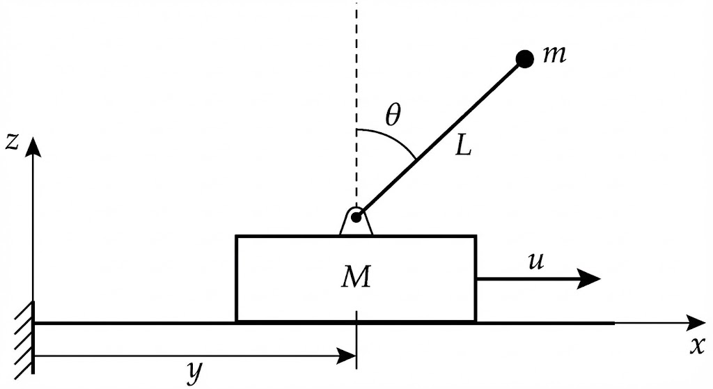
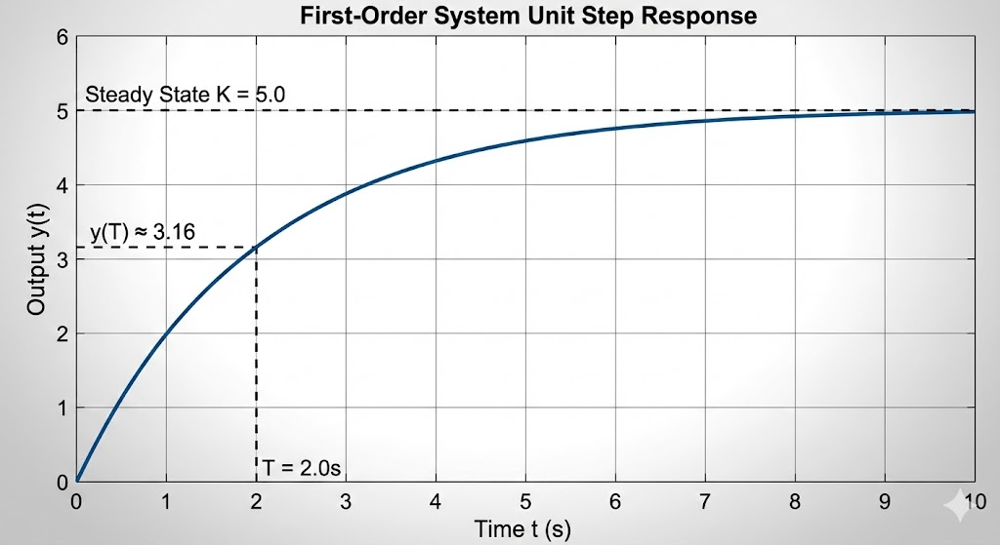
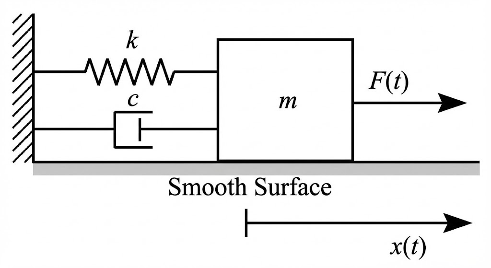

### 系统建模与仿真 2022年秋季期末考试试卷

>**考试形式**：闭卷     
>**考试时长**：120分钟

-----

#### 一、简答题（每题 5 分，共 20 分）

**1. 请简述系统的定义，并列举系统的三个基本要素。请结合一个具体实例（如交通系统或生态系统）进行说明。**

**2. 线性定常连续系统（LTI）在控制理论中常用的四种数学模型分别是什么？**

**3. 请给出“系统辨识”的定义，并列出系统辨识必须具备的三个基本要素。**

**4. 在系统辨识实验中，为了充分激发系统的动态特性，常用的输入信号有哪些？请列举三种。**

-----

### 二、编程与算法题（每题 10 分，共 20 分）

**1. MATLAB 矩阵操作**
已知矩阵 $A$ 和 $B$ 如下：

$$
A = \begin{bmatrix} 1 & 2 \\ 3 & 4 \end{bmatrix}, \quad B = \begin{bmatrix} 1 & 0 \\ 0 & 2 \end{bmatrix}
$$

请写出执行以下 MATLAB 指令后的**运行结果**：

1.  `C = A * B`
2.  `D = A .* B`
3.  `E = A(2, :)`
4.  `F = A'`

**2. 随机数生成算法**
请简述利用**乘同余法**生成高斯白噪声（正态分布随机数）的基本步骤。
*(提示：需包含生成均匀分布随机数的公式 $x_{n+1} = (a x_n) \mod m$ 以及如何将其转换为正态分布的方法，如 Box-Muller 变换)*

-----

### 三、模型转换题（共 15 分）

**已知：倒立摆系统的简化线性化微分方程模型**
下图为倒立摆系统的简化示意图（仅考虑杆围绕支点的摆动，忽略小车摩擦）。

在平衡点竖直向上位置附近线性化后，其微分方程组描述如下（其中 $y$ 为小车位移，$\theta$ 为摆杆角度， $u$ 为输入力）：

$$
\begin{cases}
\ddot{y} = - \phi \theta + u \\
\ddot{\theta} = \alpha \theta - \beta u
\end{cases}
$$

**请完成以下任务：**

1.  选取状态变量 $x = [y, \dot{y}, \theta, \dot{\theta}]^T$，输出变量为小车位移 $y$ 和摆杆角度 $\theta$，写出该系统的**状态空间表达式** ($\dot{x}=Ax+Bu, y=Cx+Du$)。
2.  假设初始条件为零，求从输入 $u$ 到摆杆角度 $\theta$ 的**传递函数** $G(s) = \frac{\Theta(s)}{U(s)}$。

-----

### 四、计算题（每题 10 分，共 20 分）

**1. 最小二乘法参数估计**
某系统的输入 $x$ 与输出 $y$ 之间满足线性关系 $y = ax + b$。通过实验测得四组数据如下表所示：

| $i$ | 1 | 2 | 3 | 4 |
| :--- | :---: | :---: | :---: | :---: |
| 输入 $x_i$ | 1 | 2 | 3 | 4 |
| 输出 $y_i$ | 2 | 3.8 | 6.2 | 8 |

请利用**最小二乘法**（Least Squares Method）求出参数 $a$ 和 $b$ 的估计值。

**2. 数值积分法**
已知一阶微分方程：
$$\frac{dy}{dt} = -y + t, \quad y(0) = 1$$
积分步长取 $h = 0.1$。请分别用以下三种方法计算 $t=0.1$ 时刻的 $y$ 值（即计算 $y_1$）：

1.  **欧拉法 (Euler Method)**
2.  **梯形法 (Trapezoidal Method / 改进欧拉法)**
3.  **四阶龙格-库塔法 (RK-4)**
    *(附 RK-4 公式：$y_{n+1} = y_n + \frac{h}{6}(K_1 + 2K_2 + 2K_3 + K_4)$，其中
    $K_1 = f(t_n, y_n)$,
    $K_2 = f(t_n + \frac{h}{2}, y_n + \frac{h}{2}K_1)$,
    $K_3 = f(t_n + \frac{h}{2}, y_n + \frac{h}{2}K_2)$,
    $K_4 = f(t_n + h, y_n + hK_3)$ )*

-----

### 五、辨识题（共 10 分）

**一阶系统参数辨识**
某未知的一阶系统 $G(s) = \frac{K}{Ts + 1}$，在输入为单位阶跃信号 $1(t)$ 作用下，测得其输出响应曲线如下图所示。

**问题：**

1.  根据上述响应特性，确定该一阶系统的**增益 $K$** 和 **时间常数 $T$**。
2.  简要说明判断理由。

-----

### 六、模型仿真题（共 15 分）

**机械系统建模与 Simulink 仿真**
如图所示，一个质量为 $m$ 的箱子放置在**光滑**水平面上（摩擦系数忽略不计）。箱子左侧通过刚度为 $k$ 的弹簧和阻尼系数为 $c$ 的阻尼器固定在墙壁上，箱子受到向右的外部推力 $F(t)$ 作用。

**请完成以下任务：**

1.  根据牛顿第二定律，列出该系统的**微分方程**。
2.  求出从外力 $F(t)$ 到位移 $x(t)$ 的**传递函数**。
3.  画出该系统在 MATLAB/Simulink 中的**仿真模型结构图**（请用积分模块 `Integrator`、增益模块 `Gain`、加法器 `Sum` 等基本模块绘制，并标注信号流向）。