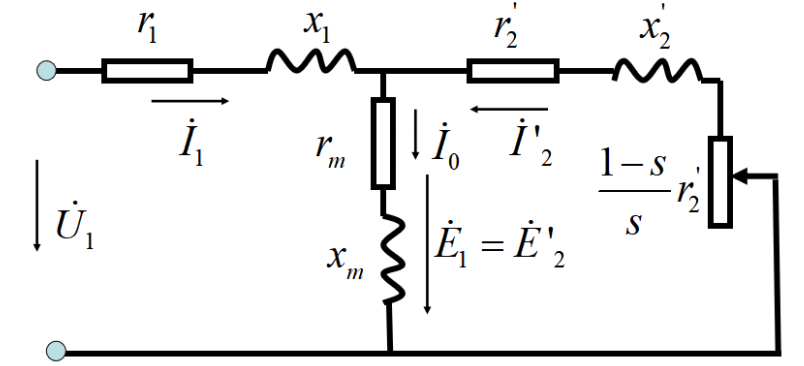

### **LEC17 异步电机的运行分析与等效电路 - 知识点详解**

---

#### **第一部分：异步电机的三种运行状态 (基于转差率 $s$)**

转差率 $s$ 是分析异步电机运行状态的**唯一判据**。电机转子转速 $n$ 与同步转速 $n_s$ 的相对关系决定了能量的流向。

**1. 基本公式**
* **同步转速**：$n_s = \frac{60f_1}{p}$ （由电源频率和极对数决定，恒定不变）。
* **转差率**：$s = \frac{n_s - n}{n_s}$ （描述转子“落后”的程度）。
* **相对转速**：$\Delta n = n_s - n = s n_s$ （旋转磁场切割转子导条的速度）。

**2. 三种状态对比表**

| 运行状态 | 转速范围 | 转差率 $s$ | 电磁转矩 $T_{em}$ 性质 | 能量转换 | 物理特征 |
| :--- | :--- | :--- | :--- | :--- | :--- |
| **电动机** | $0 < n < n_s$ | **$0 < s < 1$** | **驱动转矩** (与 $n$ 同向) | 电能 $\to$ 机械能 | 最常用状态。转子跟着磁场跑，但永远追不上。 |
| **发电机** | $n > n_s$ | **$s < 0$** | **制动转矩** (与 $n$ 反向) | 机械能 $\to$ 电能 | 外力拖动转子跑得比磁场快。常用于风力发电或再生制动。 |
| **电磁制动** | $n < 0$ | **$s > 1$** | **制动转矩** (与 $n$ 反向) | 电能+机械能 $\to$ 热能 | “倒拉反转”。转子反转，磁场正转，切割最剧烈，损耗巨大。 |

---

#### **第二部分：电磁关系与磁势平衡 (从物理到数学)**

这是建立等效电路的物理基础，也是你之前提问的重点。

**1. 频率关系 (关键)**
* **定子频率**：$f_1$ (电网频率，恒定)。
* **转子感应电动势/电流频率**：取决于相对切速度 $\Delta n$。
    $$f_2 = \frac{p \cdot \Delta n}{60} = \frac{p \cdot s n_s}{60} = s f_1$$
    * **静止/启动瞬间 ($s=1$)**：$f_2 = f_1$ (此时相当于变压器)。
    * **正常运行 ($s \approx 0.02$)**：$f_2$ 很低 (约 1-3Hz)。

**2. 磁势平衡方程式 (MMF Balance)**
* **核心逻辑**：尽管转子在转，但**转子磁动势相对于定子的转速**永远等于同步转速 $n_s$。
    * $n_{2} + n = (n_s - n) + n = n_s$
    * **结论**：定子磁势 $F_1$ 和转子磁势 $F_2$ 在空间上**相对静止**，因此可以矢量相加。
* **平衡方程**：
    $$\dot{F}_1 + \dot{F}_2 = \dot{F}_m \approx \dot{F}_0$$
    * **$\dot{F}_1$**：定子电流产生的磁势。
    * **$\dot{F}_2$**：转子感应电流产生的磁势（去磁作用）。
    * **$\dot{F}_m$**：合成磁势，由电源电压 $U_1$ 决定，基本不变。
* **电流形式**：
    $$\dot{I}_1 + \dot{I}_2' = \dot{I}_0$$
    (定子电流 = 励磁分量 + 负载分量)

---

#### **第三部分：等效电路的推导 (两大归算)**

由于实际电机中转子在旋转（频率不同）且定转子匝数不同，无法直接画在一个电路图里。必须进行两步“归算”。

**1. 频率归算 (Frequency Referral) —— 解决“转动”问题**
* **目标**：用一个**静止**的转子电路，去等效那个**旋转**的转子电路。
* **数学操作**：
    * 原始转子电流：$\dot{I}_{2s} = \frac{s \dot{E}_2}{r_2 + j(s x_2)}$
    * 分子分母同除以 $s$：
        $$\dot{I}_{2s} = \frac{\dot{E}_2}{\frac{r_2}{s} + j x_2}$$
* **物理意义**：
    * 电抗变回了静止时的 $x_2$。
    * 电阻变成了 $\frac{r_2}{s}$。这一步引入了“虚拟电阻”。

**2. 机械功率的等效体现 (难点详解)**
将归算后的电阻 $\frac{r_2}{s}$ 进行拆分：
$$\frac{r_2}{s} = r_2 + \frac{1-s}{s}r_2$$
* **$r_2$**：代表转子实际的**铜耗** (发热)。
* **$\frac{1-s}{s}r_2$**：代表电机输出的**总机械功率**。
    * **本质**：这部分电阻在电路模型中“消耗”的电能，在物理世界中并没有消失，而是通过电磁力转换成了推着转子转动的**机械能**。

**3. 绕组归算 (Winding Referral) —— 解决“匝数”问题**
* **目标**：消除定转子匝数 ($W_1, W_2$) 和绕组系数 ($k_{w1}, k_{w2}$) 的差异，类比变压器变比。
* **操作**：
    * 电压/电动势乘以变比 $k_e$。
    * 电流除以变比 $k_i$。
    * 阻抗乘以 $k_e k_i$。
* **结果**：转子参数变为 $E_2', I_2', r_2', x_2'$，可以直接与定子电路连接。

---

#### **第四部分：异步电机的“T型”等效电路 (最终模型)**

将定子电路和归算后的转子电路并联在励磁支路上，就得到了著名的 **T型等效电路**。
如下图所示：

**1. 电路结构**
* **串联支路 (定子)**：$r_1 + jx_1$ (定子电阻与漏抗)。
* **并联支路 (励磁)**：$r_m + jx_m$。
    * 流过 $I_0$ (励磁电流)。
    * $x_m$ 很大，反映主磁通路径的磁阻小（导磁好）。
* **串联支路 (转子)**：$r_2' + jx_2'$ 以及 **负载电阻 $\frac{1-s}{s}r_2'$**。
    * 流过 $I_2'$ (负载电流)。

**2. 能量守恒关系**
* **输入功率 $P_1$**：从定子端口进入。
* **定子铜耗/铁耗**：在 $r_1$ 和 $r_m$ 上消耗。
* **电磁功率 $P_{em}$**：跨过气隙传给转子的功率。
    $$P_{em} = I_2'^2 \frac{r_2'}{s}$$
* **机械功率 $P_{mech}$**：
    $$P_{mech} = I_2'^2 \frac{1-s}{s}r_2' = (1-s)P_{em}$$

---

#### **第五部分：重点复习 Checklist (避坑指南)**

1.  **为什么空载时 $I_2 \approx 0$ 但 $I_1$ 不为 0？**
    * 因为要建立主磁场 $\Phi_m$。定子必须提供激磁电流 $I_0$。异步电机的气隙有磁阻，所以 $I_0$ 比变压器大得多（约占额定电流的 20%-50%）。
2.  **电源电压 $U_1$ 不变意味着什么？**
    * 意味着主磁通 $\Phi_m$ 基本不变（$U_1 \approx E_1 \propto \Phi_m$）。
    * 意味着合成磁势 $F_m$ 基本不变。
3.  **转子静止时 ($s=1$) 和转动时 ($s<1$) 电路有什么区别？**
    * 静止时，它就是个变压器副边短路。
    * 转动时，转子频率变低，但在数学上我们把它等效为“静止 + 附加电阻”。
4.  **$F_2$ 的相位由什么决定？**
    * 由转子阻抗角 $\psi_2 = \arctan(s x_2 / r_2)$ 决定。这也是我们在做归算时必须保证 $\psi_2$ 不变的原因。