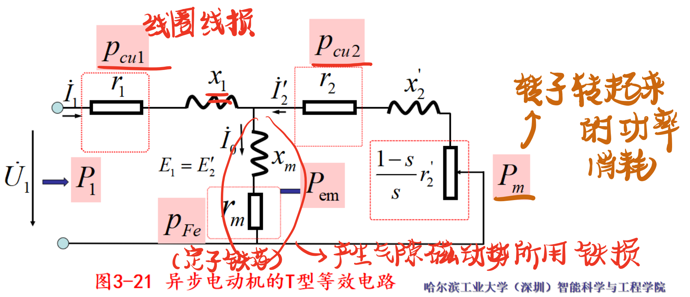
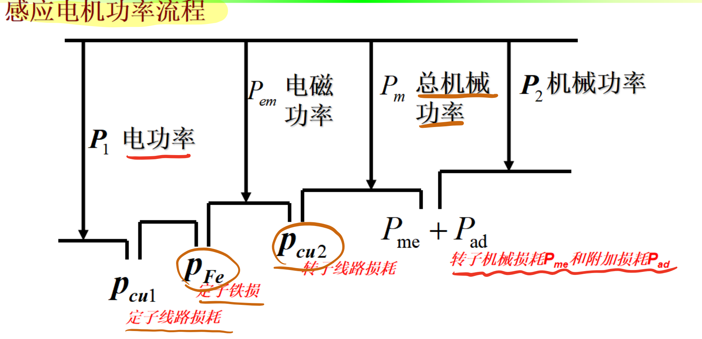

### **LEC18 - 异步电机的机械特性和调速运行 - 知识点详解**
---
### 一、 功率传输与等效电路 (The Power Flow)
**核心逻辑：** 能量从电网进来，扣除损耗，剩下的才是干活的。你问的 $I_0$ 和 机械功率 都在这里。

1.  **功率流向的“关卡”**
    * **输入功率 ($P_1$)**：定子从电网吸收的功率。
    * **电磁功率 ($P_{em}$) —— 关键枢纽**：
        * 这是跨过气隙、真正传递给转子的功率。
        * **计算**：$P_{em} = P_1 - P_{cu1} (\text{定子铜损}) - P_{Fe} (\text{铁损})$。
        * **关系**：$P_{cu2} (\text{转子铜损}) = s P_{em}$，损耗比例由转差率 $s$ 决定。
    * **总机械功率 ($P_m$) —— 你的疑问点**：
        * **定义**：这是转子真正“转起来”所获得的功率。
        * **公式**：$P_m = (1-s)P_{em}$。
        * **去向**：这部分功率减去机械损耗 ($P_{me}$) 和附加损耗 ($P_{ad}$)，就是轴上最终输出的功率 $P_2$。

1.  **等效电路中的“虚拟”角色**
    * **$I_0$ (激磁电流)**：
        * 在 T 型等效电路中，流过中间并联支路 ($r_m, x_m$) 的电流。
        * **作用**：$r_m$ 消耗的功率代表**铁损**，$x_m$ 建立气隙**主磁通**。
        * 这就是你之前觉得“诡异”的那个电流，它在空载时约等于定子电流。
 
    * **附加电阻 $\frac{1-s}{s}r_2'$**：
        * 这是为了模拟机械负载而引入的**虚拟电阻**。
        * 它上面消耗的“电功率”，物理上对应转化为**总机械功率 $P_m$**。

---

### 二、 机械特性与转矩 (The Torque)
**核心逻辑：** 转矩由电磁功率决定，与电压平方成正比。

1.  **转矩公式 (The Formula)**
    * **物理定义**：$T = \frac{P_{em}}{\omega_s}$。
    * **参数表达式**（你觉得复杂的那个）：
        $$T = \frac{m_1 p U_1^2 \frac{r_2'}{s}}{2\pi f_1 [(r_1 + \frac{r_2'}{s})^2 + (x_1 + x_2')^2]}$$
        * **关键点**：转矩 $T$ 与电压 $U_1$ 的**平方**成正比。电压跌一点，电机劲儿小很多。
 

2.  **三个运行状态 (T-s 曲线)**
    * **电动机** ($0 < s < 1$)：转速 $0 \to n_s$，转矩与转速同向。
    * **发电机** ($s < 0$)：转速超过同步转速 ($n > n_s$)，转矩反向。
    * **反接制动** ($s > 1$)：转速与磁场方向相反（如急停），转矩为制动性质。
 

3.  **最大转矩 ($T_m$) 与 过载能力**
    * **$s_m$ (临界转差率)**：转矩最大时的 $s$，与转子电阻 $r_2'$ 成正比。
    * **$T_m$ (最大转矩)**：**与转子电阻 $r_2'$ 无关**！只取决于电压和漏抗。
    * **$k_m$ (过载倍数)**：$k_m = T_m / T_n$，一般为 1.6~2.5。必须保证负载转矩小于 $T_m$，否则堵转。

---

### 三、 调速控制 (Speed Control)
**核心逻辑：** 既要平滑调速（无极），又要保持“膝点”（恒磁通）。

1.  **无极调速 (Stepless)**
    * **定义**：通过改变电源频率 $f_1$，可以**连续**调节同步转速 $n_s$，从而实现转速的无级平滑调节。
    * **对比**：变极调速是“有极”的，有台阶。
 

2.  **恒压频比控制 ($U/f$ Control) —— 基频以下**
    * **为什么要降压？(你的“膝点”问题)**
        * 根据公式 $U_1 \approx E_1 = 4.44 f_1 N \Phi_m$。
        * 如果在降低频率 $f_1$ 时不降低电压 $U_1$，磁通 $\Phi_m$ 会增加，导致磁路**过饱和**。
        * **后果**：激磁电流急剧增加，铁损增加，电机过热。
    * **策略**：保持 $U_1/f_1 = \text{常数}$，维持 $\Phi_m$ 不变（恒转矩调速）。
    * **低频补偿**：频率很低时，定子电阻压降不能忽略，需要人为适当**抬高电压**（曲线 b），以补偿压降，维持磁通。
 

3.  **弱磁控制 —— 基频以上**
    * 电压 $U_1$ 达到额定值后不能再升，只能增加频率 $f_1$。
    * **后果**：磁通 $\Phi_m$ 下降（弱磁），转矩下降，属于**恒功率调速**。

---

### 四、 单相异步电机 (Single Phase)
**核心逻辑：** 单个脉振磁场 = 两个反向旋转磁场互搏 $\to$ 起动转矩为 0。

1.  **为什么没有起动转矩？**
    * **脉振磁场**：单相绕组产生的是原地脉动的磁场。
    * **分解**：可分解为两个幅值相等、转向相反的旋转磁场 ($F_+$, $F_-$)。
    * **互搏**：在起动瞬间 ($s=1$)，正向转矩 $T_+$ 和反向转矩 $T_-$ 大小相等、方向相反，**合成转矩为 0**。
 

2.  **怎么让它转？(制造不对称)**
    * **电容分相式**：
        * 在空间上放两个相差 90° 的绕组（工作绕组 + 起动绕组）。
        * 串联电容使电流相位也差近 90°，模拟出旋转磁场。
        * **反转**：改变电容串联的位置（串在 A 还是 B 绕组），即可改变转向。
    * **罩极式 (Shaded Pole)**：
        * 利用短路环（罩极）感应电流，阻碍磁通变化，使磁通 $\Phi_2$ 滞后于 $\Phi_1$。
        * **特点**：磁场总是从无罩极部分向罩极部分移动，**转向不可变**，起动转矩小（用于风扇）。
 

---

### 五、 工程启示 (大马拉小车)
PPT 的自测题部分特别强调了这一点：
* **现象**：选额定功率过大的电机去带小负载。
* **后果**：虽然带得动，但电机运行在低效区，**功率因数低**，电流甚至可能比小电机还大，造成浪费。
* **结论**：选型要匹配，不要盲目贪大。